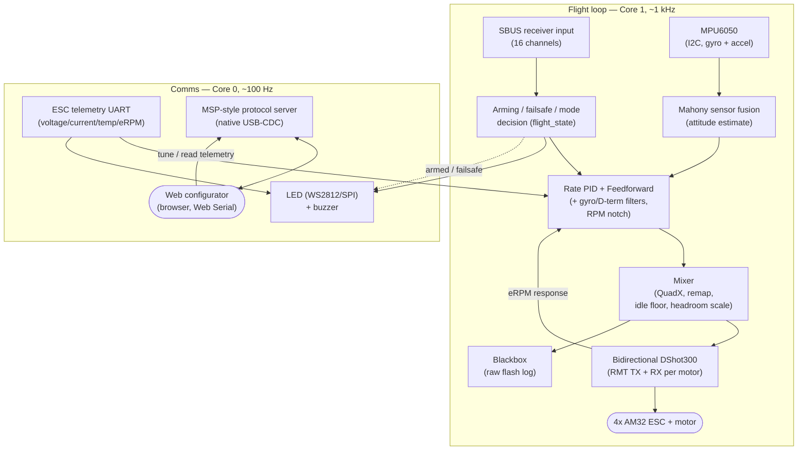

# Documentation

Project overview, build/flash instructions, the FC↔configurator wire protocol,
and the pre-flight bench-test checklist.

- **This file** — what the project is, how it's built, how the pieces fit
  together (system flow diagram below).
- **[PROTOCOL.md](PROTOCOL.md)** — the exact binary wire format between the
  firmware and the web configurator (command IDs, payload layouts).
- **[BENCH_TEST.md](BENCH_TEST.md)** — the pre-flight checklist. Read this
  before ever putting propellers on.

## What this project is

A from-scratch, Betaflight-style flight controller for a 5" freestyle
quadcopter, built on the Seeed XIAO ESP32-S3 with an MPU6050 gyro, AM32 ESCs
(bidirectional DShot300 + telemetry wire), and an SBUS receiver. It targets
Betaflight's *feel* — angle/horizon/acro modes, PID + feedforward, RPM-aware
filtering, blackbox logging, LED/buzzer status, a full browser-based tuning
UI — deliberately excluding only OSD. It is not a wire-compatible clone of
real Betaflight firmware or the real Betaflight Configurator; it's a custom
protocol and a custom configurator built to match.

The one unavoidable hardware limit: the MPU6050 is I2C-only, capping the
gyro/PID loop around 1 kHz versus 8 kHz+ on F7 boards with SPI gyros. Fine for
5" freestyle; not a match for an F7's raw loop rate or noise floor.

## System flow



## Build & flash

```bash
cd ../Code/firmware
pio run              # build
pio run -t upload    # build + flash over USB-C
pio device monitor    # serial log, 115200 baud
```

Compiles clean with `-Wall -Wextra` (verified via full clean rebuild).

## Configurator

```bash
cd ../Code/configurator
python -m http.server 8000
# open http://localhost:8000 in Chrome or Edge, click Connect
```

Web Serial requires a real HTTP origin or `localhost` — a double-clicked
`file://` page will not work reliably.

Tabs: Setup, Ports (informational), Configuration, PID Tuning, Rates,
Receiver, Modes, Motors (Betaflight-style QuadX diagram — click to spin,
reorder outputs, reverse direction, throttle capped at 50%), Failsafe,
Blackbox, CLI (read-only settings dump). No OSD tab.

## Key design decisions

- **Gyro calibration is gated on the accelerometer** confirming the board was
  genuinely still throughout the sampling window — it retries rather than
  baking in a bad bias from a bumped board.
- **Bidirectional DShot300** is implemented and on by default: inverted DShot
  out, GCR-decoded eRPM response back on the same wire, CRC-checked so a bad
  decode only degrades filter quality, never motor control. The ESC telemetry
  wire is kept as the voltage/current source and automatic RPM fallback.
- **Motor reordering and direction reversal** are done from the Motors tab —
  reordering is a real firmware remap, direction sends the actual DShot
  spin-direction command to the ESC.
- **Failsafe is an immediate motor cut**, not a staged descent — there's no
  GPS/baro on this build to do anything smarter with.
- **Blackbox restarts from flash offset 0 every boot** — download and save a
  log before your next flight if you want to keep it.

## Known gaps

No OSD (excluded by request). CLI tab is a read-only dump, not an interactive
shell. Bidirectional DShot decode and motor-direction reversal are unverified
on real ESC hardware — see [BENCH_TEST.md](BENCH_TEST.md) step 7. Nothing here
has flown yet.
